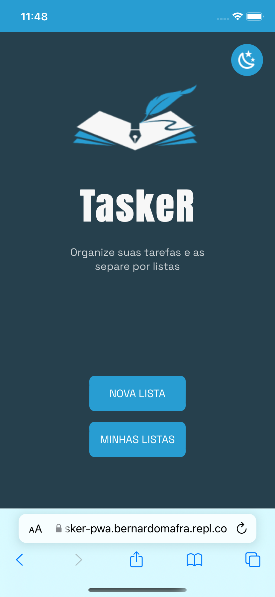
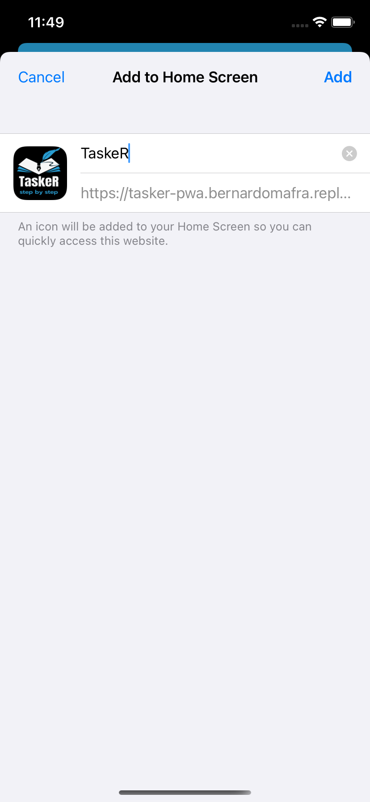
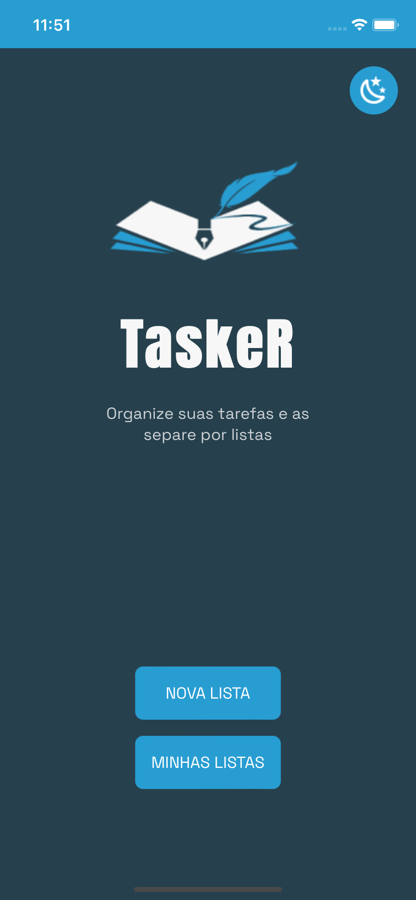

  
  
  <h1 align="center"></h1>

  
 
<h3>
    Bernardo Martinez de Oliveira Mafra  Tópicos Especiais em Sistemas de Informação: Aplicações Híbridas
</h3>
 
  

  A aplicação tem como objetivo controlar diferentes listas de tarefas. É simples mas com
  certeza traz uma agilidade para a organização cotidiana do usuário. Suas atividades
  são simples, podemos criar uma lista de tarefas e atribuir tarefas à ela, ter mais de uma
  lista para assuntos de tarefas diferentes e, por fim, gerenciar o estado de uma lista e de
  suas tarefas.
  

<section id="photos-grid" >
   
  <h1 align="center"><b>Telas da aplicação</b></h1>
   

  

    <figure>
      <figcaption>Home Page no Navegador</figcaption>
      
    </figure>
    <figure>
      <figcaption>Adicionar à tela inicial</figcaption>
      
    </figure>
    <figure>
      <figcaption>Home Page no Dispositivo</figcaption>
      
    </figure>
    <figure>
      <figcaption>Home Page no Dispositivo</figcaption>
      
    </figure>
  

<section>
 
 
